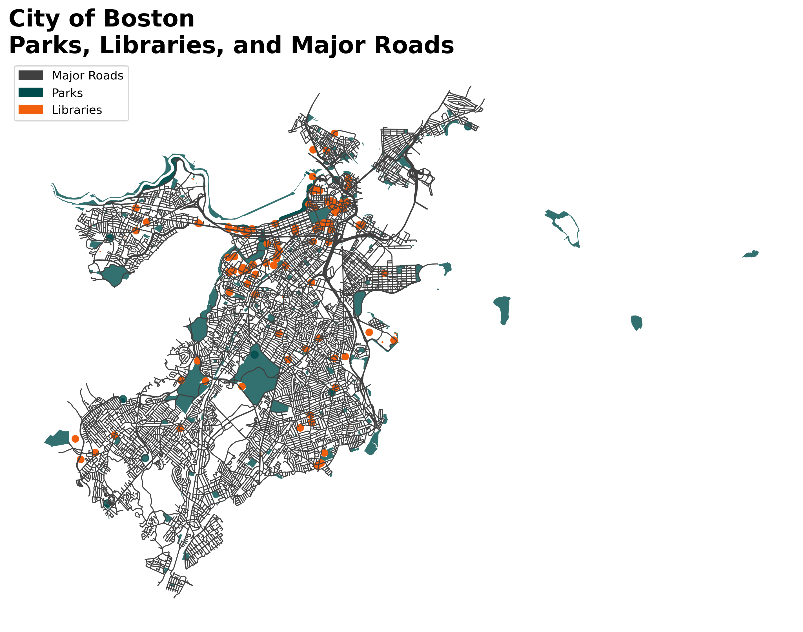
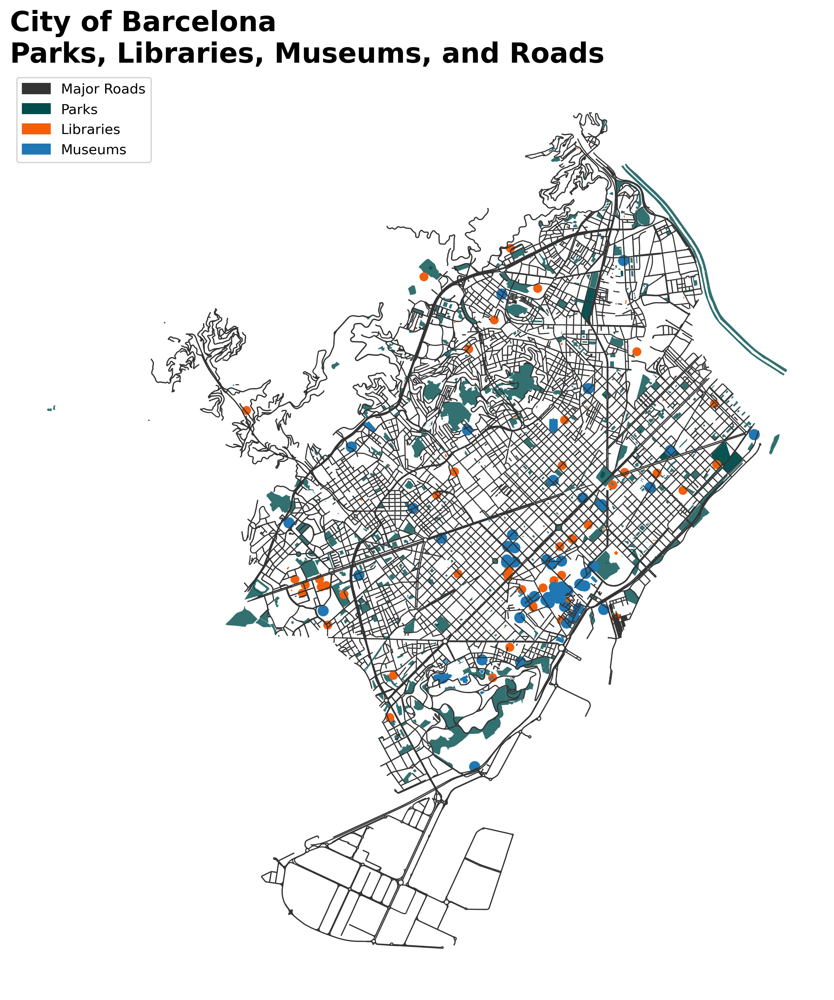

# **CityInsights: Parks, Libraries, Roads, and Museums**

**CityInsights** is a Python project that visualizes key urban features across multiple cities using OpenStreetMap (OSM) data. The project focuses on mapping and analyzing parks, libraries, museums, and major roads in cities like **Boston**, **Barcelona**, and **Amsterdam**. By leveraging Python libraries such as OSMnx, GeoPandas, and Matplotlib, this project offers an easy way to analyze the urban environment and gain insights into the distribution of essential urban features.

## Key Features

- **Parks**: Visualizes all the parks in a given city using OSM data.
- **Libraries**: Displays libraries based on data from OSM, highlighting the locations of public libraries in each city.
- **Museums**: Plots museums across the city to understand cultural attractions and tourism areas.
- **Major Roads**: Maps major roads and street networks, providing insights into transportation infrastructure.

The cities currently supported by this project are:

- **Boston** (USA)
- **Barcelona** (Spain)
- **Amsterdam** (Netherlands)

## Installation

### Requirements
Make sure you have the following Python libraries installed:

- **OSMnX**: for downloading and handling OpenStreetMap (OSM) data.
- **GeoPandas**: for working with geographical data.
- **Matplotlib**: for plotting and visualizing the data.

To install these dependencies, run:

```bash
pip install osmnx geopandas matplotlib
```

If you haven't already installed the project as a package, you can install it locally using `pip`:

```bash
pip install CityInsight
```

### Project Structure

```
CityInsight/
│
├── CityInsight/
│   ├── __init__.py
│   ├── Boston_Roads_networks.py
│   ├── Barcelona_Roads_networks.py
│   └── Amsterdam_Roads_networks.py
│
├── tests/
│   ├── test_Boston_Roads_network.py
│   ├── test_Barcelona_Roads_network.py
│   └── test_Amsterdam_Roads_network.py
│
├── setup.py
└── README.md
```

## Functions

### 1. **Plot Boston Roads Network**
The `plot_boston_roads_network()` function visualizes key urban features of **Boston** including parks, libraries, museums, and major roads. It uses OpenStreetMap data and leverages the OSMnx library to fetch the relevant geographical data for the city.

```python
from CityInsight.Boston_Roads_networks import plot_boston_roads_network

# Call the function to plot the road network and urban features in Boston
plot_boston_roads_network(show_plot=True)
```

- **show_plot** (optional, default: `True`): Whether to display the plot. Set to `False` to suppress plot display during tests.
- The plot includes:
  - Major roads in dark grey
  - Parks in dark green
  - Libraries in orange
  - Museums in dark blue

### 2. **Plot Barcelona Roads Network**
The `plot_barcelona_roads_network()` function performs a similar visualization for **Barcelona**, visualizing parks, libraries, museums, and the major road network.

```python
from CityInsight.Barcelona_Roads_networks import plot_barcelona_roads_network

# Call the function to plot the road network and urban features in Barcelona
plot_barcelona_roads_network(show_plot=True)
```

- The plot includes:
  - Major roads in dark grey
  - Parks in dark green
  - Libraries in orange
  - Museums in dark blue

### 3. **Plot Amsterdam Roads Network**
The `plot_amsterdam_roads_network()` function generates a similar visualization for **Amsterdam** focusing on parks, libraries, museums, and major roads.

```python
from CityInsight.Amsterdam_Roads_networks import plot_amsterdam_roads_network

# Call the function to plot the road network and urban features in Amsterdam
plot_amsterdam_roads_network(show_plot=True)
```

- The plot includes:
  - Major roads in dark grey
  - Parks in dark green
  - Libraries in orange
  - Museums in dark blue

## City Insight Project

Here are some of the visualizations and files used in the City Insight project:

### Street Network of Barcelona


### Street Density (km per km²)


### Log-Log KDE Distribution of Street Metrics


### Intersection Density (per km²)


### City Insight Jupyter Notebook
[City Insight.ipynb](./City%20Insight.ipynb)

### Circuity Distribution


### Circuity (Avg Edge Straightness)


### Angle Distribution of Street Networks


## Running Tests

To ensure the functionality works as expected, tests have been written for each city’s road network and urban feature visualization. You can run the tests using `pytest`.

```bash
pytest tests/test_Boston_Roads_network.py
pytest tests/test_Barcelona_Roads_network.py
pytest tests/test_Amsterdam_Roads_network.py
```

These tests:
- Check that the necessary data for parks, libraries, museums, and roads is fetched.
- Verify that the plots are generated and saved correctly (without being shown during tests).

## Output
The function will generate a PNG file for each city and save it with the following naming convention:
- `boston_roads_parks_libraries_museums.png`
- `barcelona_roads_parks_libraries_museums.png`
- `amsterdam_roads_parks_libraries_museums.png`

These files can be found in the current working directory and contain visual representations of the city's parks, libraries, museums, and road networks.

## Example Output

### **Boston**
## Boston City Map: Roads, Parks, Libraries, and Museums



### **Barcelona**


### **Amsterdam**


## Contributing

If you would like to contribute to this project, feel free to fork the repository, make improvements, and submit pull requests. Contributions are welcome to add more cities, refine visualizations, or improve the functionality of the code.

## License

This project is open-source and available under the [MIT License](LICENSE).

---

By using this project, you can easily visualize the distribution of parks, libraries, museums, and major roads in key cities across the world. **CityInsights** helps urban researchers, city planners, and enthusiasts gain valuable insights into the infrastructure of urban environments.


### **Contact**

For any inquiries or issues, please contact:

- **Author**: Ghulam Abbas Zafari
- **Email**: ghulamabbas.zafari@mail.polimi.it
```
```


